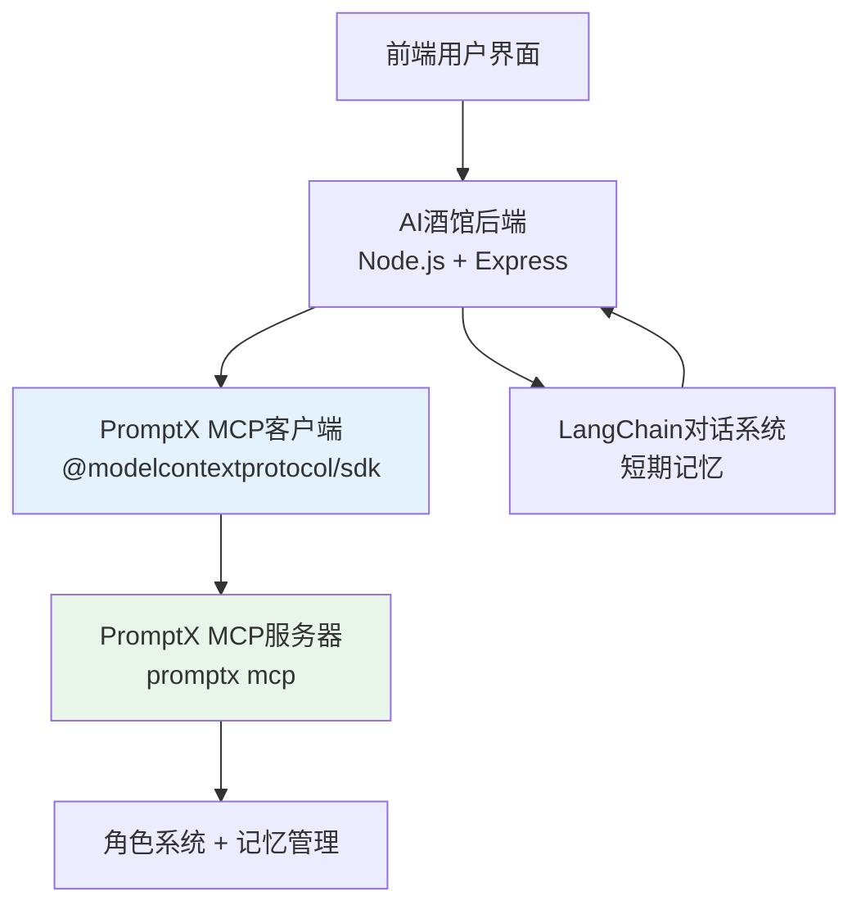

# AI酒馆 MCP集成指南

## 🎯 MCP集成架构

AI酒馆通过MCP客户端集成PromptX服务，实现角色激活和记忆管理功能。



## 🔧 核心组件

### 1. PromptX MCP客户端
- **文件**: `backend/lib/promptx-mcp-client.js`
- **功能**: 封装PromptX MCP服务调用
- **主要方法**:
  - `activateRole(roleId)` - 激活角色
  - `saveMemory(role, engrams)` - 保存记忆
  - `recallMemory(role, query)` - 回忆记忆
  - `getAvailableRoles()` - 获取角色列表

### 2. 后端API服务
- **文件**: `backend/server.js`
- **功能**: 提供REST API，桥接前端和PromptX
- **主要接口**:
  - `POST /api/promptx/roles/:roleId/activate` - 激活角色
  - `GET /api/promptx/roles` - 获取角色列表
  - `POST /api/chat/:roleId` - 对话接口
  - `POST /api/chat/:roleId/stream` - 流式对话
  - `GET /api/memory/demo/:roleId` - 记忆演示

## 🚀 使用流程

### 1. 启动PromptX MCP服务器
```bash
# 确保PromptX已安装
promptx --version

# 启动MCP服务器（自动启动）
# PromptX CLI内置MCP服务器支持
```

### 2. 启动AI酒馆后端
```bash
cd backend
npm install
npm start
```

### 3. API调用示例

#### 激活角色
```bash
curl -X POST http://localhost:3001/api/promptx/roles/ai-tavern-frontend/activate
```

#### 对话交互
```bash
curl -X POST http://localhost:3001/api/chat/ai-tavern-frontend \
  -H "Content-Type: application/json" \
  -d '{"message": "帮我设计一个酒馆风格的按钮组件"}'
```

#### 记忆演示
```bash
curl http://localhost:3001/api/memory/demo/ai-tavern-frontend
```

## 📊 双重记忆系统

### LangChain短期记忆
- **作用域**: 单次会话
- **存储内容**: 最近几轮对话
- **生命周期**: 服务重启后清空
- **用途**: 上下文理解，对话连贯性

### PromptX长期记忆
- **作用域**: 跨会话持久化
- **存储内容**: 结构化知识和体验
- **生命周期**: 永久保存
- **用途**: 知识积累，个性化服务

## 🎭 角色管理

### 内置角色
项目包含三个专业角色：
1. **ai-tavern-frontend** - 前端开发专家
2. **ai-tavern-backend** - 后端开发专家
3. **ai-tavern-integrator** - 集成协调专家

### 角色激活流程
```javascript
// 1. 通过MCP客户端激活角色
const result = await promptxClient.activateRole('ai-tavern-frontend');

// 2. 角色激活后，AI获得该角色的完整能力
// - 专业思维模式 (personality + thought)
// - 工作流程规范 (principle + execution) 
// - 专业知识体系 (knowledge)

// 3. 后续对话会以该角色身份进行
```

## 🔍 故障排除

### 常见问题

#### MCP连接失败
```bash
# 检查PromptX安装
promptx --version

# 检查MCP服务器状态
promptx welcome
```

#### 角色激活失败
```bash
# 确认角色文件路径正确
ls -la .promptx/resource/role/

# 检查角色文件格式
promptx welcome
```

#### 记忆功能异常
```bash
# 测试记忆保存
promptx remember test-role '{"content":"test","type":"TEST"}'

# 测试记忆回忆
promptx recall test-role "test"
```

## 📈 性能优化

### MCP连接池
- 使用单例模式管理MCP客户端
- 避免频繁创建/销毁连接
- 实现连接重用和错误恢复

### 内存管理
- 定期清理LangChain短期记忆
- PromptX记忆自动去重和压缩
- 监控记忆存储大小

### 并发处理
- 支持多个角色同时激活
- 异步处理记忆保存操作
- 流式响应优化用户体验

## 🚨 注意事项

### 开发环境
- 确保PromptX服务正常运行
- MCP客户端需要正确的权限配置
- 开发时可使用Mock模式降级

### 生产环境
- 配置PromptX服务器高可用
- 实现MCP连接监控和告警
- 准备完整的降级方案

### 安全考虑
- MCP传输加密（如需要）
- 角色权限控制
- 记忆数据隐私保护

---

**🍺 通过MCP集成，AI酒馆获得了PromptX的完整能力，实现了真正的角色化AI交互！**